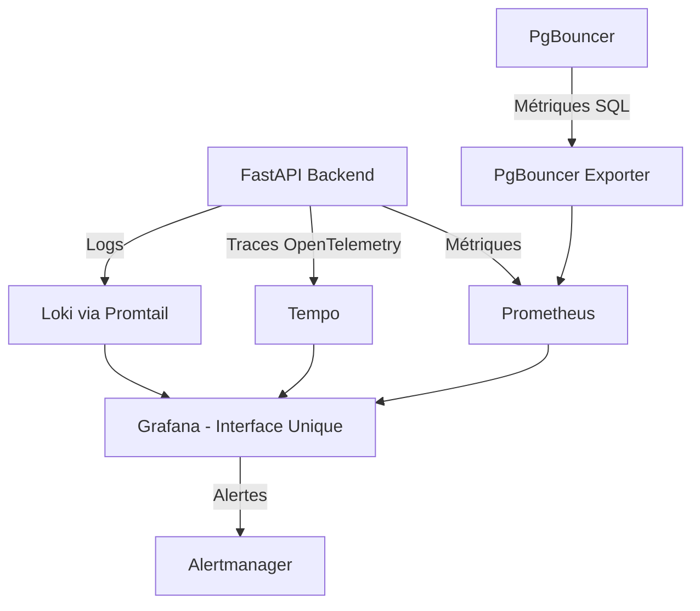

# 📊 Monitoring Stack - Moments

Ce document explique la stack de monitoring centralisée de l'application Moments.

## 🎯 Objectifs

Cette stack répond à 4 besoins spécifiques :
1. **🔴 Savoir si le backend est down** → Health check + alertes
2. **🐌 Repérer des endpoints trop lents** → Métriques de latence P95/P99
3. **🔍 Avoir des traces claires** → Tempo pour comprendre les lenteurs
4. **🗄️ Optimiser les appels BDD** → Traces SQL + métriques PgBouncer

## 🏗️ Architecture



## 🔧 Services

### **Prometheus** (Port 9090)
- **Rôle** : Collecte et stockage des métriques
- **Sources** :
  - FastAPI `/metrics` (latence, requêtes/sec, erreurs)
  - PgBouncer Exporter (connexions DB, latence SQL)
- **Données** : Time-series sur 30 jours

### **Tempo** (Port 3200)
- **Rôle** : Collecte et stockage des traces distribuées
- **Source** : OpenTelemetry depuis FastAPI (ports 4317/4318)
- **Instrumentation** :
  - Routes FastAPI automatiquement tracées
  - Requêtes SQLAlchemy tracées avec durée
- **Usage** : Identifier les goulots d'étranglement
- **Interface** : Intégré dans Grafana (pas d'UI dédiée)

### **Loki + Promtail**
- **Rôle** : Collecte et stockage des logs
- **Sources** :
  - Logs applicatifs (`/app/logs/app.log`)
  - Logs des scripts (cleanup, backup)
  - Logs containers Docker (stdout/stderr)
  - Logs système (syslog, auth.log) si disponibles
- **Avantage** : Recherche et filtrage avancés

### **Grafana** (Port 3000)
- **Rôle** : Interface unique de visualisation
- **Datasources** :
  - Prometheus (métriques)
  - Tempo (traces)
  - Loki (logs)
- **Fonctionnalités** :
  - Dashboards temps réel
  - Corrélation logs/métriques/traces
  - Système d'alertes intégré

## 📱 Dashboards Disponibles

### 1. **"Moments - Overview"** (Principal)
- 🔴 **Status Backend** : UP/DOWN en temps réel
- 📊 **Métriques clés** : RPS, latence P95, taux d'erreur
- 📈 **Graphiques** : Latence par endpoint, performance SQL
- 🔍 **Traces lentes** : Endpoints > 500ms automatiquement
- 📋 **Logs d'erreurs** : Erreurs récentes corrélées

### 2. **"Moments - Application Logs"**
- Logs applicatifs et scripts
- Logs containers
- Logs infrastructure
- Filtrage par niveau (ERROR, INFO, etc.)

## 🚨 Alertes (Configuration future)

> ⚠️ **Alertes email non configurées actuellement**

### Configuration à ajouter :

#### **Alertmanager Service**
```yaml
alertmanager:
  image: prom/alertmanager:latest
  volumes:
    - ./monitoring/alertmanager/alertmanager.yml:/etc/alertmanager/alertmanager.yml
```

#### **Règles d'alerte**
- **Backend Down** : `up{job="moments-backend"} == 0`
- **Latence élevée** : `histogram_quantile(0.95, rate(http_request_duration_seconds_bucket[5m])) > 2`
- **Taux d'erreur** : `rate(http_requests_total{status=~"5.."}[5m]) / rate(http_requests_total[5m]) > 0.05`
- **Erreurs SQL** : `increase(pgbouncer_stats_queries_errors_total[5m]) > 10`

#### **Configuration email**
```yaml
# alertmanager.yml
route:
  receiver: 'web.hook'
receivers:
- name: 'web.hook'
  email_configs:
  - to: 'admin@moments.com'
    subject: '[ALERT] Moments API - {{ .GroupLabels.alertname }}'
    body: |
      Alert: {{ .GroupLabels.alertname }}
      Status: {{ .Status }}
      Instance: {{ .GroupLabels.instance }}
```

## 🚀 Déploiement

### **Lancer la stack complète**
```bash
cd /path/to/moments
docker-compose -f docker-compose.prod.yml up -d
```

### **Vérifier le statut**
```bash
docker-compose -f docker-compose.prod.yml ps
```

### **Accès aux interfaces**
- **Grafana** : `http://serveur:3000` (admin/moments2024!)
- **Prometheus** : `http://serveur:9090` (debug uniquement)
- **Tempo** : Intégré dans Grafana (onglet "Explore" → datasource "Tempo")

## 📋 Utilisation Quotidienne

### **Dashboard Principal**
1. Ouvrir Grafana : `http://serveur:3000`
2. Aller sur "Moments - Overview"
3. **Vérifications rapides** :
   - ✅ Backend status = UP
   - ✅ Latence P95 < 500ms
   - ✅ Taux d'erreur < 5%

### **Debugging Performance**
1. **Endpoint lent identifié** → Graphique "Latence par Endpoint"
2. **Cliquer sur trace** → Panel "Traces récentes > 500ms"
3. **Analyser** :
   - Temps total de la requête
   - Temps passé en base (spans SQL)
   - Goulots d'étranglement

### **Debugging Erreurs**
1. **Erreur détectée** → Panel "Logs d'Erreurs Récents"
2. **Cliquer sur log** → Voir trace associée
3. **Analyser** :
   - Stack trace complète
   - Requête SQL qui a échoué
   - Contexte utilisateur

## 🔍 Requêtes Utiles

### **LogQL (Loki)**
```logql
# Logs de l'application FastAPI
{job="moments-app"}

# Erreurs applicatives
{job="moments-app"} | level="ERROR"

# Scripts de maintenance (cleanup, backup, etc.)
{job="moments-scripts"}

# Logs spécifiques cleanup
{job="moments-scripts"} |= "cleanup"

# Logs d'un utilisateur spécifique
{job="moments-app"} |= "user_id=123"
```

### **PromQL (Prometheus)**
```promql
# Latence P95 par endpoint
histogram_quantile(0.95, rate(http_request_duration_seconds_bucket{job="moments-backend"}[5m])) by (handler)

# Top 5 endpoints les plus appelés
topk(5, rate(http_requests_total{job="moments-backend"}[5m]))

# Connexions DB actives
pgbouncer_pools_client_active_connections
```

### **TraceQL (Tempo)**
```
# Toutes les traces
{}

# Traces du service moments-api
{resource.service.name="moments-api"}

# Traces lentes (plus de 500ms)
{resource.service.name="moments-api" && duration > 500ms}

# Traces avec erreurs
{resource.service.name="moments-api" && status = error}

# Traces par endpoint HTTP spécifique
{resource.service.name="moments-api" && span.http.route = "/cadeaux"}
```

## 📈 Métriques Importantes

### **Performance Application**
- **RPS** : Requêtes par seconde
- **Latence P50/P95** : Temps de réponse médian/95e percentile
- **Taux d'erreur** : % de requêtes 4xx/5xx

### **Performance Base de Données**
- **Connexions actives** : Charge sur PgBouncer
- **Latence SQL** : Temps de traitement en base
- **Requêtes en attente** : Saturation des pools

### **Ressources Système**
- **Logs d'erreurs** : Problèmes applicatifs
- **Logs containers** : Problèmes infrastructure

## 🛠️ Maintenance

### **Rétention des données**
- **Prometheus** : 30 jours (configurable)
- **Tempo** : 48h (configurable dans tempo.yml)
- **Loki** : Rotation automatique des logs

### **Volumes Docker**
```bash
# Nettoyer les données (attention : perte définitive)
docker volume rm moments_prometheus-data
docker volume rm moments_tempo-data  
docker volume rm moments_loki-data

# Redémarrer proprement
docker-compose -f docker-compose.prod.yml down
docker-compose -f docker-compose.prod.yml up -d
```

## 🚨 Troubleshooting

### **Pas de métriques dans Grafana**
1. Vérifier Prometheus : `http://serveur:9090/targets`
2. Endpoint `/metrics` accessible : `curl backend:8000/metrics`
3. Datasource Prometheus configurée dans Grafana

### **Pas de traces dans Grafana**  
1. Vérifier Tempo : `docker logs moments-tempo`
2. Variable OTEL_ENDPOINT = `http://tempo:4318/v1/traces` dans FastAPI
3. Datasource Tempo configurée dans Grafana
4. Tester connectivité : `docker exec moments-backend python -c "import socket; s=socket.socket(); s.connect(('tempo', 4318)); print('OK')"`

### **Pas de logs dans Grafana**
1. Vérifier Promtail : `docker logs moments-promtail`
2. Fichiers logs présents : `ls -la backend/logs/`
3. Datasource Loki configurée dans Grafana

## 📞 Support

Pour ajouter les **alertes email**, suivez la section "Alertes" et créez les fichiers de configuration Alertmanager.

La stack actuelle vous donne **visibilité complète** sur votre application sans avoir besoin de multiples outils ou VMs séparées.